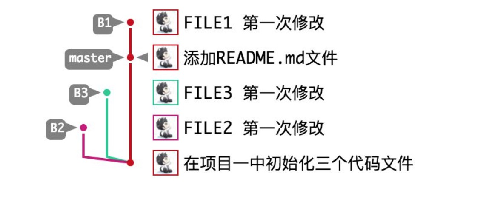

#### 防止会有很多merge,例如

##### 1. 下游分支更新上游分支内容的时候使用 rebase  --------- git rebase origin master
##### 2. 上游分支合并下游分支内容的时候使用 merge  --------- git merge dev
##### 3. 更新当前分支的内容时一定要使用 --rebase 参数  --------- git --rebase origin master
